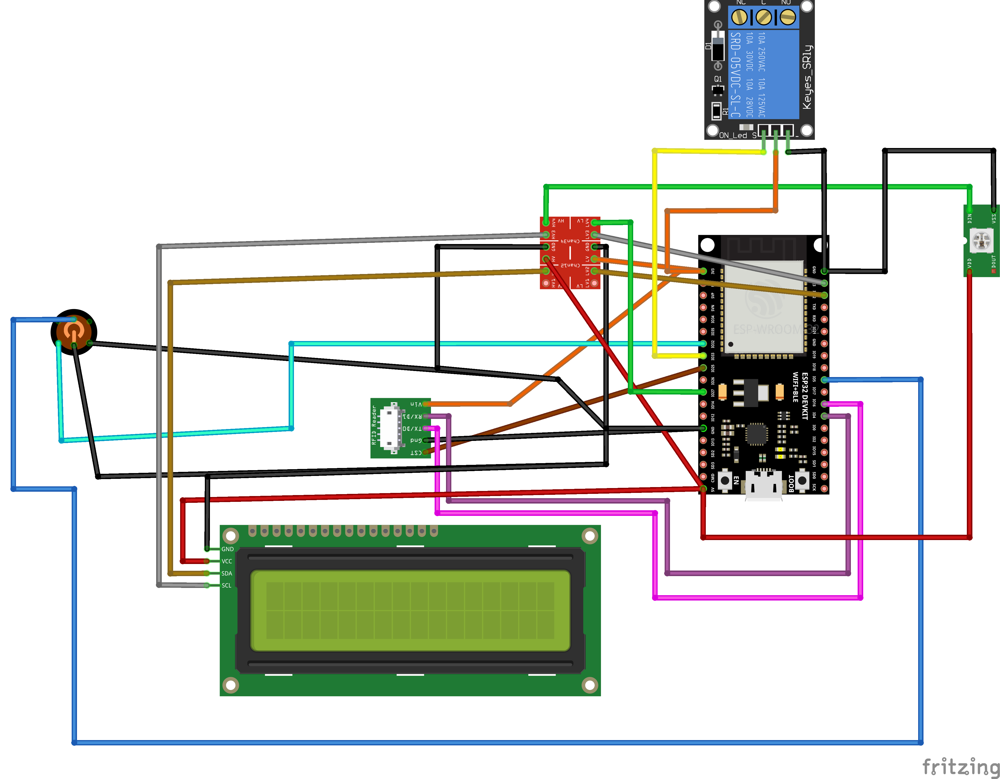

.. _hardware:

Hardware
========

The "machine control unit" (MCU) devices use ESP32 microcontrollers; our reference builds use ESP32-DevKitC / ESP32-WROOM-32D boards such as `these from Amazon <https://www.amazon.com/gp/product/B09Z7Q5LKQ/>`__. For reasons described in :ref:`the introduction <introduction.mcu-software>` we use `ESPHome <https://esphome.io/>`__ as the software on the ESP32s.

.. _hardware.v1:

Version 1 Hardware
------------------

This describes the initial Version 1 MCU hardware, essentially a prototype assembled from off-the-shelf components and fitted in a 3D printed enclosure.

.. _hardware.v1.components:

Components
++++++++++

* 1x ESP32 38-pin wide dev board, such as the `Dorhea ESP32-DevKitC WEOOM-32U on Amazon <https://www.amazon.com/gp/product/B09Z7Q5LKQ/>`__
* 1x Screw terminal breakout board for that ESP32, such as `this one on Amazon <https://www.amazon.com/gp/product/B0C3QM5ZHP/>`__
* 1x 16x2 backlit character LCD display with I2C backpack (i.e. PCF8574T) such as `this one on Amazon <https://www.amazon.com/gp/product/B07T8ZG5D1/>`__
* 1x 4-channel bi-directional 3.3v/5v level converter such as `one of these on Amazon <https://www.amazon.com/gp/product/B07F7W91LC/>`__
* 1x clockless 12mm WS2812-type addressable RGB LED; I'm currently using ones clipped out of a string of `these Amazon waterproof 5V LEDs <https://www.amazon.com/gp/product/B01AG923GI/>`__ just because I had a bunch of them on hand.
* 1x 3.3v controlled optoisolated relay module to switch up to 10A; I'm currently using one of `these from Amazon <https://www.amazon.com/gp/product/B09SZ71K4L/>`__
* 1x 16mm red LED-backlit momentary pushbutton with flip-up transparent shield/cover. I specifically use the `MPJA 34155 SW pushbutton <https://www.mpja.com/SPDT-Momentary-Pushbutton-Switch-12V-Red/productinfo/34155+SW/>`__ and the now-discontinued `MPJA 34167 SW transparent shield <https://www.mpja.com/16mm-Pushbutton-Switch-Transparent-Shield/productinfo/34167+SW/>`__ but any standard SPST or SPDT momentary pushbutton will work **as long as** its LED can be driven directly by 3.3VDC.
* 1x wiegand protocol 3.3-5VDC RFID reader with a card present output. I'm currently using `this item from the e_goto Processors Store on AliExpress <https://www.aliexpress.us/item/2255800841398634.html>`__ that ships directly from the manufacturer in China. The only important part about this specific item is it's a fairly rare unit that can work directly on 3.3VDC with 3.3V communication, so it doesn't require an additional two channels of level converter. Also, it has a ``CST`` line that's pulled high when a RFID tag is within range of the reader.
* 1x GX16-8 locking connector pair, such as `MPJA 32426 PL <https://www.mpja.com/Connector-Pair-Locking-8-Pin/productinfo/32426+PL/>`__.

.. _hardware.v1.wiring:

Wiring
++++++

This is intended to work with `esphome-configs/2024.6.4/no-current-input.yaml </esphome-configs/2024.6.4/no-current-input.yaml>`__.

* RFID Reader

  * ``CST`` to ``GPIO25``
  * ``Gnd`` to ground
  * ``TX/D0`` to ``GPIO16``
  * ``RX/D1`` to ``GPIO4``
  * ``3.3-5V`` to 3v3

* Level Converter

  * Gnd and Gnd to ground
  * LV to ESP32 ``3v3``
  * HV to ESP32 ``5v``
  * 2 - ``LV2`` to ``GPIO22``; ``HV2`` to LCD ``SDA``
  * 3 - ``LV3`` to ``GPIO23``; ``HV3`` to LCD ``SCL``
  * 4 - ``LV4`` to ``GPIO27``; ``HV4`` to Neopixel ``D1``

* Pushbutton

  * LED ``-`` to ``Gnd``
  * LED ``+`` to ``GPIO5``
  * Switch ``NC`` to ``Gnd``
  * Switch ``Com`` to ``GPIO32``

* Neopixel

  * ``5v`` to ``5v``
  * ``Gnd`` to ``Gnd``
  * ``D1`` to Level Converter ``HV4`` to ``GPIO27``

* LCD Display

  * ``Gnd`` to ``Gnd``
  * ``VCC`` to ``5v``
  * ``SDA`` to Level Converter ``HV2`` to ``GPIO22``
  * ``SCL`` to Level Converter ``HV3`` to ``GPIO23``

* Optoisolated Relay

  * ``Gnd`` to ``Gnd``
  * ``In`` to ``GPIO33``
  * ``VCC`` to ``3v3``

.. _hardware.v1.enclosure:

Enclosure
+++++++++

RFID card/fob holder - https://github.com/jantman/laser-cutter-projects/tree/main/rfid-card-fob-holder

.. _hardware.esphome-configs:

ESPHome Configurations
----------------------

Example ESPHome configurations for various ESPHome versions and various hardware combinations can be found in the `esphome-configs/ directory of the git repo <https://github.com/jantman/machine-access-control/tree/main/esphome-configs>`__ broken down by ESPHome version.

All of the example ESPHome configurations begin with a ``substitutions`` key, which contains a ``machine_name`` substitution. This must be set to the same name as used in the :ref:`configuration.machines-json` config file. If desired, you can override the ``esphome`` ``name`` and ``friendly_name`` values (though this is not recommended).

The ESPHome configurations are based on a `ESPHome secrets.yaml file <https://esphome.io/guides/faq.html#tips-for-using-esphome>`__ for substituting in sensitive values and installation-specific values using the ``!secrets`` substitution operator. The example configurations expect the following secrets to be defined:

api_encryption_key
    this is needed for the ESPHome web UI functionality, like wirelessly streaming logs. See ESPHome docs.

ota_password
    A password used for OTA updates from ESPHome. See ESPHome docs.

wifi_ssid
    WiFi network SSID to connect to. See ESPHome docs.

wifi_password
    WiFi network password. See ESPHome docs.

domain_name
    Domain name to use for DNS. See ESPHome docs.

mac_url
    the full URL to the /api/machine/update endpoint of the machine-access-control server
